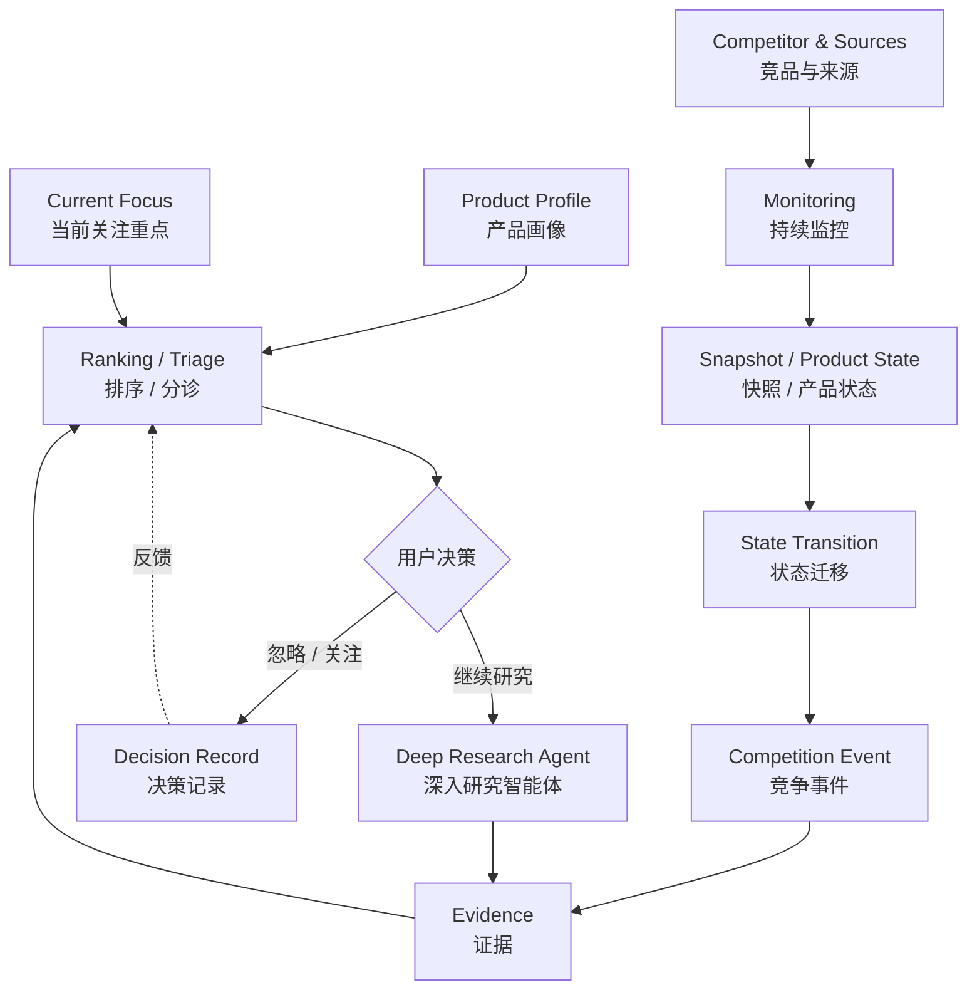

# Product Intelligence Agent

Product Intelligence Agent（产品智能研究助手）是一个面向产品经理和产品团队的竞争信号监控、分诊与研究系统。

它持续观察竞品的公开来源，保存可比较的历史内容与交互状态，从变化中识别可能的竞争事件，再结合自身产品上下文判断哪些事件值得优先关注；对于重要但证据不足的问题，系统继续搜索、阅读和核验证据。

项目围绕三段核心产品链路展开：

```text
Monitoring（监控）
发生了什么？
        ↓
Triage（分诊）
哪些变化最值得关注，为什么？
        ↓
Deep Research（深入研究）
这件事到底意味着什么？
```

当前仓库主要完成了 Monitoring 的数据基础：静态与浏览器网页采集、内容质量判断、结构化内容抽取、页面快照与历史比较，以及经过安全校验的 Interactive State Traversal（交互状态遍历）。State-aware Change Detection（状态感知变化检测）、竞争事件识别、证据管理、Triage 和 Deep Research 等上层能力尚未实现。

## 为什么需要专门的竞争情报工作流

传统竞品研究通常依赖人工搜索、阅读多个网页、一次性整理，再由研究者判断哪些信息是最近变化、哪些只是当前事实。这种方式可以完成单次分析，却很难持续、可靠地回答：

- 竞品和上一次观察相比发生了什么变化？
- 当前能力是最近上线，还是过去已经存在、只是第一次被系统观察到？
- 一处网页文案变化是否对应真实的产品状态变化？
- 一个宣布中的能力后来是否真正上线，范围、价格或限制是否继续变化？
- 多个来源是在报道不同事件，还是在补充同一事件的证据？
- 大量竞争信号中，哪些与当前产品最相关，产品经理应该先看什么？

ChatGPT、Kimi、DeepSeek 等通用大模型已经能够完成搜索、总结、分析、知识库、记忆和部分定时任务。本项目不试图重复这些通用能力，核心差异也不在于“模型更聪明”，而在于把采集、历史、状态、事件、证据和用户决策组织成持续工作流。

| 维度 | 通用大模型常见使用方式 | Product Intelligence Agent 关注点 |
| --- | --- | --- |
| 起点 | 用户主动提出问题 | 系统持续监控已配置来源 |
| 过程 | 搜索、阅读、总结、分析 | 采集、保存历史、比较状态、识别变化 |
| 时间关系 | 主要回答当前问题 | 比较 Previous State（上一状态）与 Current State（当前状态） |
| 输出 | 一次回答或分析结果 | State Transition（状态迁移）、Competition Event（竞争事件）与 Evidence（证据） |
| 后续 | 用户继续追问 | 分诊、排序、补充证据和深入研究 |

竞争情报不是“抓取网页后总结一次”，而是：

```text
持续监控来源
→ 保存历史
→ 比较前后状态
→ 识别状态迁移
→ 建立竞争事件
→ 聚合与核验证据
→ 结合产品上下文分诊
→ 对重要问题深入研究
```

Monitoring 解决“不要漏掉变化”，Triage 把大量信号压缩成少量值得优先关注的事件，Deep Research 则围绕重要事件继续补齐证据和解释。大语言模型是其中的判断组件，而不是对历史状态、来源管理、失败处理、去重和评测的替代。

## 完整产品设计



这张图描述的是完整产品方向，不代表所有模块都已实现。当前代码事实见[当前已实现能力](#当前已实现能力)与[尚未实现的能力](#尚未实现的能力)。

### Monitoring：建立可比较的历史

Monitoring 持续观察已配置竞品和来源，采集可信内容并保存历史。它不只检查 HTTP 是否返回 `200`，还需要回答：

- 页面正文是否真实可用；
- 内容来自服务器 HTML，还是需要浏览器渲染或交互后才能出现；
- 本次采集与上次是否采用相同抽取规则、可以直接比较；
- 采集失败代表页面无变化，还是来源、权限或抓取方式已经失效；
- 变化发生在哪个语义区域，属于哪个可识别状态。

完整设计将来源分成两类：

| 来源方式 | 主要职责 | 典型来源 | 使用特点 |
| --- | --- | --- | --- |
| Fixed Sources（固定来源） | 高频、稳定、可比较的持续监控 | 官网、定价页、产品文档、更新日志 | 预先配置并持续保存历史，适合发现状态变化 |
| Public Search（公开搜索） | 低频补漏、发现新来源、补充证据 | 新闻、采访、社区讨论、第三方评测 | 围绕问题搜索，不替代固定来源的历史监控 |

固定来源负责连续时间轴，公开搜索负责扩大证据覆盖。长期设计还需要 Source Health（来源健康状态），显式记录抓取失败、正文异常、页面结构变化和长期不可访问；当前仓库只实现了单次采集的内容质量门槛。

### 从网页快照到竞争事件

系统需要区分四个层次：

```text
Snapshot（网页快照）
某次采集看到的页面内容
        ↓
Product State（产品状态）
根据页面与证据建立的当前业务事实
        ↓
State Transition（状态迁移）
Previous State 与 Current State 之间的可信变化
        ↓
Competition Event（竞争事件）
对产品团队有明确竞争意义的状态变化
```

页面新增一句文字，不一定代表产品能力刚刚上线；页面没有变化，也不能证明产品没有变化。Announcement（宣布）、开放测试、Launch（正式上线）、范围扩大、价格调整和限制变化也应作为不同状态节点，而不是被压成同一个事实。

### Product Profile、Current Focus 与 Triage

事件的重要性不是固定属性。同一个竞争事件，对不同产品、发展阶段和团队目标的意义可能不同。

- Product Profile（产品画像）描述自身产品的目标用户、核心场景、能力边界、定位和竞品关系。
- Current Focus（当前关注重点）描述团队此刻关注的定价、企业能力、模型效果、生态合作或特定市场。

Triage 结合产品上下文、事件类型、潜在影响、时间紧迫性和证据可信度，帮助用户判断哪些事件值得优先关注、证据是否充分，以及应该忽略、持续观察还是进入深入研究。

### Evidence、Content Dedup 与 Event Dedup

Competition Event 不是一篇网页的摘要。一个事件可以关联多条 Evidence，并随着新来源出现而被补充、核验、质疑或修正。证据判断至少包含两个独立问题：来源本身是否可信，以及它实际能够证明什么。

系统还需要区分两个去重层次：

- Content Deduplication（内容去重）：处理相同正文、转载、镜像或重复 DOM 内容。
- Event Deduplication（事件去重）：判断不同内容是否指向同一竞争事件，并把它们作为多条 Evidence 聚合。

当前仓库已实现单页抽取阶段的保守重复 DOM 序列去重，尚未实现跨页面内容去重和事件去重。

### Deep Research 与 Decision Record

Deep Research 只针对值得继续投入注意力的问题启动，例如寻找一手来源、核对宣布与实际上线时间、确认适用范围、解释证据冲突，以及追踪定价或限制的后续变化。研究结果应回到原事件的 Evidence 集合，而不是成为与历史脱节的一次性回答。

用户对事件作出的“忽略、关注、继续研究”等选择，完整设计中会保存为 Decision Record（决策记录），为后续排序评测和产品纠偏提供反馈。该能力当前尚未实现。

## Workflow、LLM 与 Agent 的边界

本项目不把所有流程都设计成 Agent（智能体）。

| 能力形态 | 适合承担的任务 | 原因 |
| --- | --- | --- |
| Workflow（确定性工作流） | 采集、质量门槛、快照、版本保护、状态比较、失败处理 | 输入输出明确，需要稳定、可复现、可审计 |
| LLM（大语言模型） | 业务事实抽取、候选事件识别、语义归并、相关性和证据判断 | 需要结合自然语言与业务上下文 |
| Agent（智能体） | 围绕重要事件进行多步搜索、阅读和核验 | 下一步无法完全预先固定，需要受约束的自适应探索 |

确定性环节不需要为了“智能”而交给 Agent；LLM 输出也不能绕过证据、版本、失败状态和评测机制直接成为事实。Agent 主要服务于 Deep Research，而不是替代整个 Monitoring 管线。

## 当前系统工作方式

```mermaid
flowchart LR
    A[网页 URL] --> B[Static Acquisition<br/>静态采集]
    B --> C{Quality Gate<br/>质量门槛}
    C -->|可信| D[Structured Content<br/>结构化内容]
    C -->|不足或存在交互信号| E[Browser Acquisition<br/>浏览器采集]
    E --> F[Rendered Visibility<br/>渲染可见性]
    F --> D
    D --> G[Snapshot / Interactive State<br/>快照 / 交互状态]
    G --> H[Content Hash & Previous Snapshot<br/>内容哈希与历史快照]
    H --> I[Page Change Detection / Contextual Diff<br/>页面变化检测 / 上下文差异]
    I -. 尚未实现 .-> J[State-aware Change Detection<br/>状态感知变化检测]
    J -. 后续阶段 .-> K[Event Detection & Evidence<br/>事件识别与证据]
    K -.-> L[Triage & Deep Research<br/>分诊 / 深入研究]
```



当前采集链路采用 Fail Closed（失败时关闭下游）：只有通过质量门槛的内容才能进入可信 Snapshot 和页面变化检测。交互页面还需要确认控件可见、状态可验证且没有导航、下载或新窗口等副作用，再从其实际控制的局部范围采集状态。

Interactive State Traversal 已能够自动编排安全 Tab 状态并形成父→子语义路径，但这些 Interactive States 尚未写入正式 Snapshot，也尚未进入 State-aware Change Detection。

## 当前已实现能力

以下能力已经在仓库中实现，并经过自动化回归测试及真实网页人工验收。

### 网页采集与质量控制

- Static Acquisition（静态网页采集）：通过 HTTP 请求读取服务器返回的 HTML。
- Browser Fallback / Enrichment（浏览器兜底 / 补充采集）：静态结果失败、质量不可信或存在明确交互信号时，使用 Playwright Chromium 获取渲染后内容。
- Content Quality Gate（内容质量门槛）：识别可信正文、异常稀疏内容和动态加载占位页，失败结果不会污染可信历史。
- Rendered Visibility（渲染可见性处理）：排除明确隐藏的 DOM，同时保留视口外正文和可能等待滚动显现的正常内容。

### 结构与展示语义

- Structured Blocks（结构化内容块）：保留 heading、paragraph、list、table、code 等基础结构。
- Group / Card（分组 / 卡片结构）：保留卡片标题、内部 Blocks、链接、定义列表键值和文本标记。
- Repeated DOM Sequence Deduplication（重复 DOM 序列去重）：根据同一父容器中的完整重复子树序列，保守移除轮播复制内容。
- Presentation Semantics Preservation（展示语义保留）：保留显式 HTML 语义，以及浏览器 computed style（计算样式）中的 `strikethrough` 等展示事实。

采集层只保存网页事实。例如，它记录一段文字带有删除线，但不会直接把删除线解释成“原价”；业务含义由后续语义层结合上下文判断。

### 快照与页面变化

- Snapshot（页面快照）与 Content Hash（内容哈希）：保存带时区采集时间、抽取版本和内容摘要的 UTF-8 JSON 历史记录。
- Previous Snapshot Lookup（上一快照查询）：按 URL 和快照内部采集时间查找最近的上一份历史记录。
- Change Detection（页面变化检测）：通过标准化页面内容哈希判断页面是否变化。
- Extraction Version Protection（抽取版本保护）：抽取规则升级时跳过新旧版本之间的无效比较。
- Diff / Contextual Diff（差异 / 上下文差异）：生成行级差异，并利用标题路径、表格、列表和邻近上下文恢复变化所属区域。

这里的 Change Detection 是页面级内容变化检测，不是 State-aware Change Detection，也不会把所有 Diff 自动解释成竞争事件。

### 安全交互状态与遍历

- Safe Tab Group Discovery（安全标签组发现）：发现具有明确 ARIA 选中状态、可见且可交互的标准 Tab 组。
- Semantic State Identity（语义状态身份）：使用语义区域路径和状态文本生成稳定身份，不把 DOM 序号作为持久化身份。
- Safe Tab Interaction（安全标签交互）与 Post-click Validation（点击后校验）：验证选中状态、URL、窗口、下载和局部 DOM 稳定性，并支持恢复默认状态。
- Local Scope Resolver（局部范围解析）：优先使用 ARIA 关系，否则根据排除控件后的内容变化定位最小可信业务区域。
- Interactive State Capture（交互状态采集）：从已验证 Local Scope 生成 Structured Blocks、语义身份、内容哈希和采集时间。
- Interactive State Traversal（交互状态遍历）：按 DOM 顺序自动编排顶层安全 Tab Group，并在父状态 Local Scope 内进行最多两层的有限嵌套遍历。
- Traversal Bounds（遍历边界）：限制嵌套深度、单组可操作选项和单页非默认状态数量，并记录截断、跳过和恢复结果。
- Nested State Content Ownership（嵌套状态内容归属）：子状态独立拥有其 Local Scope 内容；父节点排除已建模子范围，没有独立内容时明确标记为不可比较的导航节点。
- Restore & Failure Isolation（恢复与失败隔离）：退出子层后先恢复子组，再恢复父组；关键恢复失败或出现导航、窗口、下载风险时中止整页遍历。

### 质量保障

- 使用可控本地 HTML 的单元与浏览器自动化回归测试。
- 使用真实网页覆盖静态采集、动态渲染、复杂结构、交互状态和可见性边界的 Manual E2E Acceptance（人工端到端验收）。
- 使用抽取版本保护，避免算法升级制造虚假页面 Diff。

## 尚未实现的能力

以下模块属于已确定的产品方向，但不能视为当前仓库已经完成：

- State-aware Change Detection（状态感知变化检测）及 Interactive State 历史持久化
- 长期 Source Health（来源健康监控）与采集调度
- Product Profile（产品画像）与 Current Focus（当前关注重点）
- Public Search（公开搜索补漏与新来源发现）
- LLM Event Detection（大语言模型竞争事件识别）
- Evidence 数据模型、证据聚合、冲突处理与核验
- 跨页面 Content Deduplication（内容去重）
- Event Deduplication（事件去重）
- Ranking / Triage（排序 / 分诊）
- Deep Research Agent（深入研究智能体）
- Decision Record（决策记录）与用户纠偏闭环
- 面向 AI 判断的系统化 Evaluation（评测）、Gold Set（金标集）和 Bad Case 迭代

## 核心设计原则

- **Current Fact ≠ Event**：当前网页存在某项能力，不代表它最近发生了变化。
- **First Observed ≠ Newly Launched**：第一次观察到只能建立当前基线，不能直接判断“刚刚上线”。
- **Snapshot ≠ Product State**：快照记录网页内容，产品状态描述经过证据支持的业务事实。
- **Page Change ≠ Competition Event**：文字、布局或模板变化不一定具有竞争意义。
- **Previous State + Current State → State Transition**：事件判断应建立在可信状态迁移之上。
- **Announcement ≠ Launch**：宣布、开放测试、正式上线、扩大范围和调整限制是不同状态节点。
- **Evidence Quality > Quantity**：来源数量不能替代来源质量、证明范围和证据独立性。
- **Acquisition First, Interpretation Later**：采集层忠实保存结构、交互状态和展示语义，语义层再判断业务含义。
- **Stable Identity over DOM Position**：持久化身份使用语义路径，不依赖脆弱的 DOM 序号。
- **Fail Closed**：采集质量、交互安全或局部范围不可信时停止下游处理，不把失败伪装成正常结果。
- **Explicit Uncertainty**：证据不足或相互冲突时保留不确定性，不强行生成确定结论。
- **Evaluation before Trust**：模型能够输出结果不等于判断可靠，必须通过可重复评测和 Bad Case 迭代建立可信度。

## 真实验证与质量保障

项目使用自动化测试、真实网页人工验收和 Bad Case 驱动迭代相结合的方式。现有验证覆盖：

- 服务器直接返回正文的静态网页；
- 依赖 JavaScript 的动态渲染网页；
- Pricing（定价）页面中的套餐、表格和卡片结构；
- Release Notes / Changelog（版本说明 / 更新日志）的标题、列表和上下文关系；
- Tab 默认状态、安全切换、嵌套遍历、恢复和 Local Scope；
- 隐藏菜单、响应式副本、轮播复制、滚动显现内容等边界；
- CSS computed style 表达的删除线等展示语义；
- 相同交互状态的内容哈希稳定性与嵌套内容归属；
- 抽取版本变化时的跨版本比较保护。

自动化测试使用可控的本地 HTML 与浏览器环境，避免把公网变化作为稳定测试前提。真实网页用于验证复杂页面的端到端表现，并把失败案例转化为通用规则和回归测试，而不是为单一网站增加业务硬编码。

当前质量验证主要针对采集、结构抽取和交互遍历等确定性能力，不等同于尚未建设的 AI Evaluation。进入事件识别、Triage 和 Deep Research 阶段后，还需要建设 Gold Set，并分别评估事件识别、证据归因、去重、排序和研究结论。

## 快速开始

### 1. 创建并启用虚拟环境

Windows PowerShell：

```powershell
python -m venv .venv
.\.venv\Scripts\Activate.ps1
```

### 2. 安装依赖与 Chromium

```powershell
python -m pip install -r requirements.txt
python -m playwright install chromium
```

主要依赖：

- `requests`：静态 HTTP 采集
- `beautifulsoup4`：HTML 解析
- `playwright`：浏览器渲染、可见性处理与安全交互

### 3. 运行当前 Stage 1 页面入口

```powershell
python backend/page_reader.py "https://example.com"
```

可以通过 `--timeout` 设置静态请求超时秒数：

```powershell
python backend/page_reader.py "https://example.com" --timeout 5
```

程序优先进行静态采集，并在符合条件时使用浏览器兜底或补充采集。质量检查通过后，会在 `data/snapshots/` 保存 UTF-8 JSON Snapshot，并输出当前快照、上一快照、内容哈希、页面变化状态和 Diff。

首次采集没有可比较历史，`changed` 为 `null`；抽取版本变化时也会跳过直接比较并返回明确原因。采集失败时，程序向标准错误输出结构化错误并返回非零退出码。

`backend/page_reader.py` 是当前 Monitoring 页面链路的命令行入口，不代表完整产品的最终交互形态；Interactive State Traversal 当前是独立生产能力，尚未接入正式 Snapshot 和状态感知变化检测。

### 4. 运行自动化测试

```powershell
python -m unittest discover -s tests -v
```

如果本地已经安装 `pytest`，也可以运行：

```powershell
python -m pytest
```

### 5. 运行交互状态人工验收

真实网页 Traversal 验收：

```powershell
python -m experiments.manual_v033_acceptance --mode traversal
```

本地嵌套 Traversal fixture 验收：

```powershell
python -m experiments.manual_v033d2_nested_traversal
```

两个入口都会显示浏览器并直接调用正式 Traversal Orchestrator，不保存 Snapshot，也不自动给出验收结论。

## 项目结构与文档入口

```text
backend/      网页采集、结构抽取、快照、变化检测和交互状态能力
tests/        可控 HTML、浏览器与流程回归测试
experiments/  真实网页诊断、本地 fixture 和人工验收入口
data/         正式运行生成的本地快照等数据
docs/         开发路线图和当前迭代文档
```

- [Development Roadmap（开发路线图）](docs/development-roadmap.md)
- [Current Sprint（当前迭代）](docs/current-sprint.md)
- [AGENTS.md（项目开发规范）](AGENTS.md)

## 当前边界

- 当前系统处理公开网页来源，不绕过登录、权限、验证码或站点访问限制。
- 浏览器交互只覆盖可发现、可验证、可恢复且无明显副作用的标准安全 Tab 场景，不执行表单提交、购买、下载或不可逆操作。
- Interactive State Traversal 当前最多处理两层嵌套，并限制单组可操作选项和单页非默认状态数量；达到边界会明确记录截断，不把未遍历状态解释为缺失。
- 当前 Change Detection 仍以标准化页面内容为基础；Interactive State 尚未持久化，也尚未形成 State-aware Change Detection、Product State 或 Competition Event。
- 当前命令行输出服务于 Monitoring 链路开发和验证，尚未提供完整产品界面、事件中心或研究工作台。

项目现阶段先建立可靠、可追溯、可比较的 Monitoring 数据基础，再在其上实现可评测的事件识别、Triage 和 Deep Research，避免模型直接在不完整或不可验证的输入上生成竞争结论。
